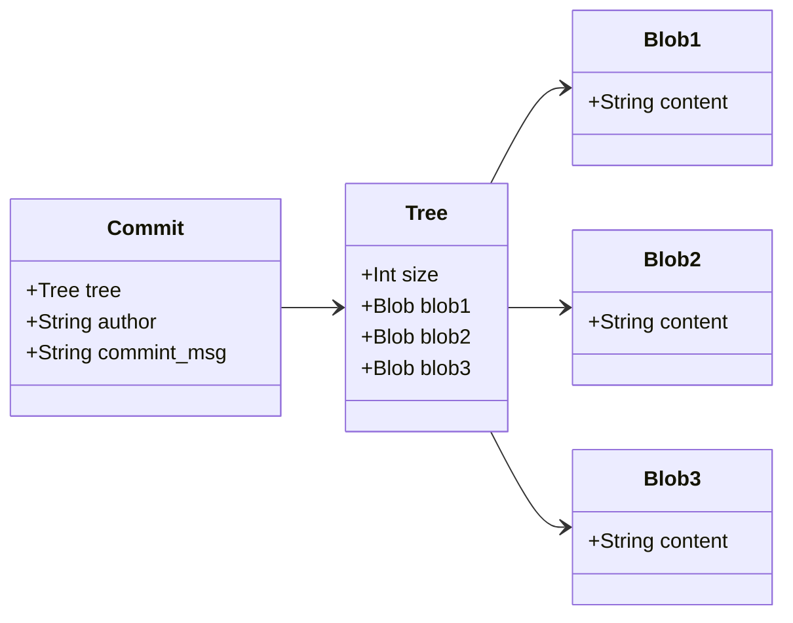
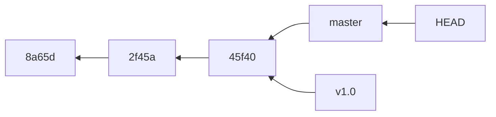
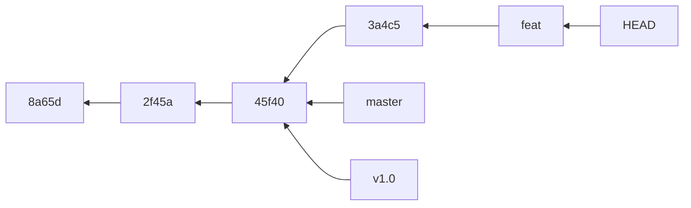

## git存储方式
- 特点 \
git保存的不是文件的变化或者差异, 而是一系列不同时刻的快照
- blob对象 \
保存着文件的快照, 使用blob格式保存**文件的内容**
- 树对象 \
保存着文件名和对应的blob对象引用地址, 使用**树格式保存文件目录结构**
- 提交对象 \
保存着树对象引用地址和作者、提交信息等信息, 使用提交格式保存提交记录


- <font color="red">总结</font> 
  1. git每次提交时, 会产生一个提交对象, 这个对象保存了提交的作者的姓名, 邮箱, 提交时输入的信息 
    - 还保存了一个指向暂存对象(树对象)的指针, 这个树对象保存了所有文件的快照的引用和目录结构, 可以快速还原整个工作区
    - 第一个提交对象没有指向父提交对象, 合并的提交对象指向2个父提交对象, 普通的提交有一个父提交对象
    - 初始化数据库, 会有一个分支指针, master指向最后一个提交对象
    - 存储结构总结为 提交对象 --> 树对象 --> 文件快照(Blob), 后面的讲解都是到提交对象, 不再涉及提交对象下级的对象 \
    只有提交对象和别的提交对象有关系, 树对象和Blob对象, 只和当前的提交对象有关系
  2. 为了节省空间, 如果文件没有改变, 则文件不会产生新的Blob对象, 树对象的指向会复用原先的Blob对象

## 分支的操作
- 分支的本质 \
分支的本质, 仅仅是指向提交对象的可变指针, 不保存任何分支相关的内容



- 分支创建 \
  本质就是创建一个指针, 指向某个提交对象
  ```bash
  # 创建一个指向当前提交对象的指针feat
  git branch feat
  ```
  ```mermaid
  flowchart RL
  id3[45f40] --> id2[2f45a] --> id1[8a65d]
  master --> id3
  v1.0 --> id3
  HEAD --> master
  feat ---> id3
  ```
  此时, v1.0, feat, master均指向最后一个提交, 那么如何区分当前在哪个分支上? HEAD指针指向的就是当前的分支

  - 分支的本质, 查看.git/refs目录下可以得知, 分支名即为文件名, 分支指向的commit对象的hash值, 就是文件的内容 \
  所以新建一个分支, 就是在.git/refs目录下新建一个分支名的文件, 内部保存了commit对象的hash值

- HEAD指针 \
指向当前所在分支
```bash
# 此命令可以展示e380ee3 (HEAD -> master, feat, v1.0), 可以知道此时分支是master, 也会列出指向该提交的其他分支指针
git log --oneline
```
- 分支切换
  本质就是切换HEAD指针指向
  ```bash
  git checkout feat
  ```
  ```mermaid
  flowchart RL
  id3[45f40] --> id2[2f45a] --> id1[8a65d]
  master --> id3
  v1.0 --> id3
  feat ---> id3
  HEAD --> feat
  ```
  - 分支切换会重建工作目录, 如果工作区有未提交内容且和切换分支有冲突, 切换分支会失败, 所以切换分支前, 最好先提交或者暂存当前工作目录

- <font color="red">HEAD会随分支指针一起移动</font> 
假设, 此时feat分支新增一个提交id4(3a4c5)



