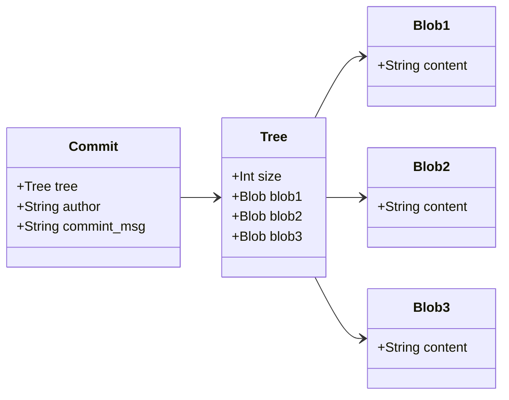
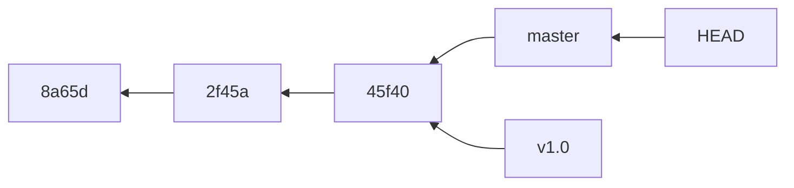
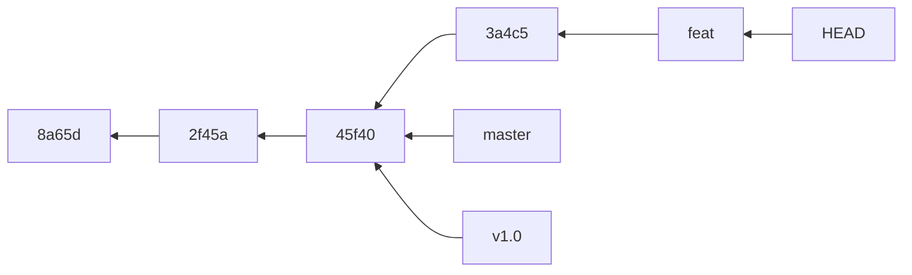

## git存储方式
- 特点 \
git保存的不是文件的变化或者差异, 而是一系列不同时刻的快照
- blob对象 \
保存着文件的快照, 使用blob格式保存**文件的内容**
- 树对象 \
保存着文件名和对应的blob对象引用地址, 使用**树格式保存文件目录结构**
- 提交对象 \
保存着树对象引用地址和作者、提交信息等信息, 使用提交格式保存提交记录


- <font color="red">总结</font> 
  1. git每次提交时, 会产生一个提交对象, 这个对象保存了提交的作者的姓名, 邮箱, 提交时输入的信息 
    - 还保存了一个指向暂存对象(树对象)的指针, 这个树对象保存了所有文件的快照的引用和目录结构, 可以快速还原整个工作区
    - 第一个提交对象没有指向父提交对象, 合并的提交对象指向2个父提交对象, 普通的提交有一个父提交对象
    - 初始化数据库, 会有一个分支指针, master指向最后一个提交对象
    - 存储结构总结为 提交对象 --> 树对象 --> 文件快照(Blob), 后面的讲解都是到提交对象, 不再涉及提交对象下级的对象 \
    只有提交对象和别的提交对象有关系, 树对象和Blob对象, 只和当前的提交对象有关系
  2. 为了节省空间, 如果文件没有改变, 则文件不会产生新的Blob对象, 树对象的指向会复用原先的Blob对象

## 分支的操作
- 分支的本质 \
分支的本质, 仅仅是指向提交对象的可变指针, 不保存任何分支相关的内容



- 分支创建 \
  本质就是创建一个指针, 指向某个提交对象
  ```bash
  # 创建一个指向当前提交对象的指针feat
  git branch feat
  ```
  ```mermaid
  flowchart RL
  id3[45f40] --> id2[2f45a] --> id1[8a65d]
  master --> id3
  v1.0 --> id3
  HEAD --> master
  feat ---> id3
  ```
  此时, v1.0, feat, master均指向最后一个提交, 那么如何区分当前在哪个分支上? HEAD指针指向的就是当前的分支

  - 分支的本质, 查看.git/refs目录下可以得知, 分支名即为文件名, 分支指向的commit对象的hash值, 就是文件的内容 \
  所以新建一个分支, 就是在.git/refs目录下新建一个分支名的文件, 内部保存了commit对象的hash值

- HEAD指针 \
指向当前所在分支
```bash
# 此命令可以展示e380ee3 (HEAD -> master, feat, v1.0), 可以知道此时分支是master, 也会列出指向该提交的其他分支指针
git log --oneline
```
- 分支切换
  本质就是切换HEAD指针指向
  ```bash
  git checkout feat
  ```
  ```mermaid
  flowchart RL
  id3[45f40] --> id2[2f45a] --> id1[8a65d]
  master --> id3
  v1.0 --> id3
  feat ---> id3
  HEAD --> feat
  ```
  - 分支切换会重置工作目录, 使得工作目录回到切换分支最后一次提交时的样子, 如果工作区有未提交内容且和切换分支有冲突, 切换分支会失败, 所以切换分支前, 最好先提交或者暂存当前工作目录

- <font color="red">HEAD会随分支指针一起移动</font> 
假设, 此时feat分支新增一个提交id4(3a4c5)


## 分支的合并操作
- 简单命令
  ```bash
  # 创建分支branch_name, 并且切换到branch_name分支
  git checkout -b branch_name
  # 相当于以下两条命令
  git branch branch_name
  git checkout branch_name
  ```
- 快速合并 \
  本质是: 指针的移动, 不涉及合并操作, 没有冲突 \
  假设场景, master分支最后提交为a3, 从a3处新开分支hotfix, hotfix修复bug, 提交了a4, 验证通过, 想要将hotfix合并回a3, 具体操作如下
  ```bash
  # 新开分支hotfix
  git checkout -b hotfix
  # hotfix提交
  git add .
  git commit -m "提交信息"
  # 切回master, 合并hotfix内容
  git checkout master
  git merge hotfix
  ```
  ```mermaid
  flowchart RL
  a4 --> a3 --> a2 --> a1
  master --> a3
  hotfix --> a4
  ```
  1. 此时, git merge 日志会打印 <font color="red">Fast-forward</font>
  2. 由于要合入的hotfix的a4提交, 可以直接走到master的a3提交, 所以合并hotfix分支, 只需要将master的指向右移到a4就可以, 这种合并方式, 只是指针的移动, 不需要合并操作, 不会产生冲突, 简单来说就是, master分支在新开hotfix分支后, 没有新的提交或者合入
  3. 合并后的结构如下
  ```mermaid
  flowchart RL
  a4 --> a3 --> a2 --> a1
  master --> a4
  hotfix --> a4
  ```

- 合并 
  1. 假设从master的提交a3新开分支issue, 并且在issue上提交了a5, a6, 在master上有新的提交a4, 此时想将issue合并回master
  由于从一个比较早的节点开出的分支issue, 此时master分支不再是issue的直接祖先, 也就是从issue不能直接通达master, 所以不能
  适应快速合并 
  2. 本质: 假如两个分支不能快速合并, 则会利用两个分支的末端提交(a4, a6)和公共祖先提交(a3), 做三方合并, 合并的结果生成一个新的快照提交(a7), 
  这个快照提交有两个父提交, 分别是这两个分支的末端提交(a4, a6) 
  3. <font color="red">注意:</font> 非快速合并, 会产生一个新的合并提交快照
  4. 合并前分支
  ```mermaid
    flowchart RL
    a4 --> a3 --> a2 --> a1
    master --> a4
    a5 --> a3
    a6 --> a5
    issue --> a6
  ```
  5. 合并后分支
  ```mermaid
    flowchart RL
    a4 --> a3 --> a2 --> a1
    a5 --> a3
    a6 --> a5
    a7 --> a4
    a7 --> a6
    issue --> a6
    master --> a7

  ```
  6. 冲突解决 \
  注意: 如果在不同的分支中, 对同一个文件的同一部分做了修改, 合并时则会产生冲突 \
  此时git会做合并,但是不会自动创建一个新的合并提交, 冲突文件大概如下
  ```js
    // <<<<<<< HEAD, HEAD代表当前分支 和 =======之间是当前分支的修改
    // ======= 和 >>>>>>> issue 之间代表 issue分支的修改, 也即传入的更改
    // 可以选择手动修改冲突, 修改完要去掉标识,<<<<<<< ======= >>>>>>>
    <<<<<<< HEAD
    "test1148";
    =======
    "test1142";
    >>>>>>> issue
  ```
  手动修改完冲突之后, 执行git add 文件名, 将文件标记为已解决, 并且执行 git commit完成合并提交, 生产合并提交节点
  ```bash
  # 使用git add 文件名, 标记文件为已解决
  git add 文件名
  # 使用git commit, 生成合并提交节点, 此时会打开提交信息页面, 可以修改提交信息, 也可以直接执行:wq, 使用默认提交信息
  git commit
  ```
## 远程分支
- 简介 \
  远程引用是对远程仓库的引用(分支, 标签等)
  ```bash
  # 获取远程仓库信息
  git remote show <remote>
  ```
  会显示如下信息
  ```bash
  远程 origin
  获取地址：git@codeup.aliyun.com:xxx/xxx.git
  推送地址：git@codeup.aliyun.com:xxx/xxx.git
  HEAD 分支：master
  远程分支：
    activity                  已跟踪
  为 'git pull' 配置的本地分支：
    activity 与远程 activity 合并
  为 'git push' 配置的本地引用：
    activity 推送至 activity (最新)
  ```
- 远程跟踪分支 \
  远程跟踪分支远程分支状态的引用, 本地无法移动, 只有和远程仓库进行了通信, 才会移动, 所以要获取最新的远程状态, 一定要先git fetch
  1. 命名方式: 
  ```bash
  # 比如远程仓库origin的master分支的引用名称为origin/master
  <remote>/<branch>
  ```
  ```mermaid
  flowchart RL
  c3 --> c2 --> c1
  master --> c3
  origin/master --> c3
  ```
  <font color="red">注意: </font> 只要不和远端服务器连接,比如git fetch等操作, origin/master 分支指针就不会移动和修改 \
  比如, 本地master和远端master都有了新的提交, 但是没有fetch服务器, 那么本地master会移动, 但是origin/master不会移动
   ```mermaid
  flowchart RL
  c4 --> c3 --> c2 --> c1
  master --> c4
  origin/master --> c3
  ```
  此时使用 git fetch origin拉取远端分支, origin/master就会更新
  ```mermaid
  flowchart RL
  c4 --> c3 --> c2 --> c1
  master --> c4
  c5 --> c3
  origin/master --> c5
  ```
  2. 推送 \
  语法: git push &lt;remote&gt; &lt;local_branch&gt;:&lt;remote_branch&gt; \
  将本地分支(local_branch)推送到远端(remote)的分支remote_branch \
  ```bash
  # 推荐使用缩写方式, 代表将分支local_branch推送到远端的与local_branch相同的分支
  git push remote local_branch
  # 使用 -u 参数可以推送时设置远程跟踪分支, 下一次再提交时, 就可以直接使用 git push 推送到远端, 不需要带上remote local_branch
  git push -u remote local_branch
  # 下次提交时
  git push
  ```
  <font color="red">注意:</font> 
    - 本地分支直接使用分支名称
    - 远端分支一般使用 远端仓库+空格+远端分支名称
    - 远端在本地的远端跟踪分支, 使用 远端仓库简称 + / + 远端分支名称
  
  3. 拉取 \
  使用 git fetch remote(origin) 可以拉取远端的分支信息, 假设远端新增了一个feat分支 \
  此时会生成一个远端跟踪分支指针origin/feat
  ```bash
  # 使用git merge 合并分支到当前分支
  git merge origin/feat
  # 基于远程跟踪分支, 新开新的本地分支(feat), 并切换到新的本地分支
  git checkout -b feat origin/feat
  ```
  
